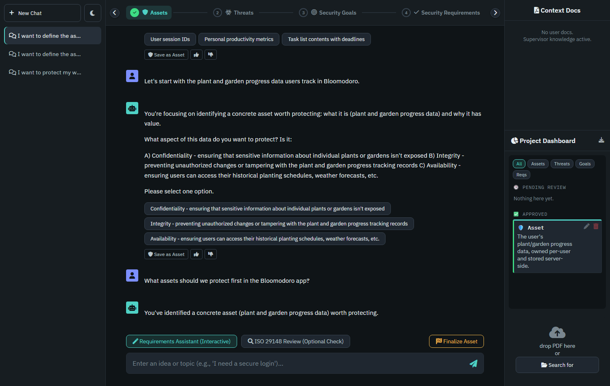
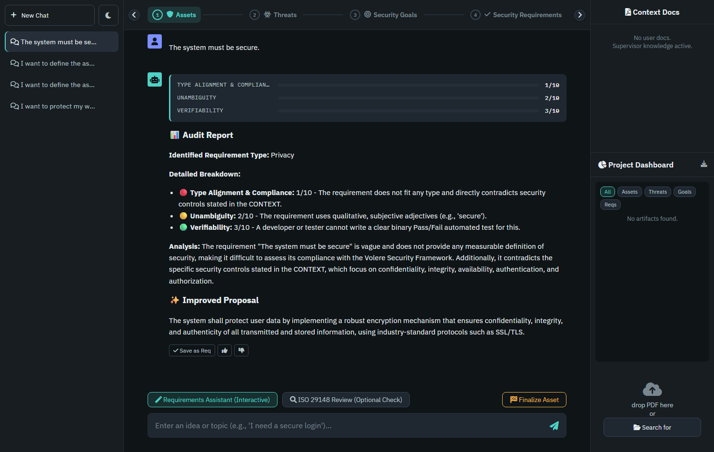

# Security Requirements Assistant

A local, privacy-preserving chatbot that helps you elicit and audit **security requirements** for a software system, following a structured **Asset → Threat → Goal → Requirement** process inspired by ISO/IEC/IEEE 29148 and the Volere Security Framework.

It runs entirely on your own machine: a local LLM ([GPT4All](https://www.nomic.ai/gpt4all), Llama‑3.2‑3B‑Instruct) generates every response, a local [ChromaDB](https://www.trychroma.com/) vector store handles document retrieval, and all chat/session data lives in a local SQLite file. Nothing is sent to a third-party API.

This project was built as part of a Master's thesis on AI-assisted Security Requirements Engineering, using a fictional case-study app ("Bloomodoro") to demonstrate the workflow.

## What it does

The assistant works in two modes:

- **Elicitation (Requirements Assistant)** — a guided, conversational mode. You pick one of four process steps (Asset, Threat, Security Goal, Security Requirement), describe what you have in mind, and the assistant asks one focused follow-up question at a time with concrete options to choose from, until you have something worth saving.
- **Audit (ISO 29148 Review)** — a scoring mode. Paste a candidate requirement and the assistant scores it against three ISO 29148 criteria (Unambiguity, Verifiability, Type Alignment) and proposes a SMART rewrite.

Anything worth keeping gets saved as a **pending artifact**; you then explicitly **accept, refine, or discard** it in the dashboard. Only accepted artifacts count as the project's final output and are fed back into the assistant as context for later turns. Once you're happy with a step, **Finalize** asks the assistant to summarize the whole discussion into one clean artifact instead of you having to do it by hand. The approved set can be **exported** as a Markdown requirements document at any time.

## Screenshots

**Guided elicitation** — the assistant asks one question at a time, offers clickable options, and the stepper tracks which of the 4 steps has at least one accepted artifact:



**ISO 29148 audit** — a submitted requirement is scored against the rubric, with the three criteria visualized as score meters:



## Project structure

```
app/
  main.py             # builds the FastAPI app and wires up the routers below
  config.py            # all tunable settings (model name, paths, generation limits, ...)
  core/
    database.py          # ChatDatabase - the SQLite layer (sessions, messages, artifacts)
    ingestion.py           # DocumentIngestor - PDF chunking, ChromaDB, retrieval
    rag_engine.py            # RagEngine - loads the LLM, builds prompts, generates replies
    prompts.py                 # the system prompts and per-step guidance text
  api/
    sessions.py, documents.py, artifacts.py, chat.py   # one FastAPI router per resource
  templates/index.html  # the single-page UI (markup only)
  static/css/style.css   # styling
  static/js/app.js        # all frontend behavior (fetch() calls into app/api/)
knowledge_base/         # PDFs always available as background knowledge (see below)
scripts/debug/          # small standalone scripts used during development
```

## Requirements

- Python 3.12+ (developed and tested on Windows; should work on macOS/Linux as-is)
- ~2 GB free disk space for the LLM (downloaded automatically on first run)
- A GPU is optional — the app auto-detects and uses one if available (NVIDIA via CUDA, AMD/Intel via Vulkan, Apple Silicon via Metal) and otherwise falls back to CPU

## Setup

1. **Clone the repository and enter it**

   ```bash
   git clone https://github.com/computervogel/security-chatbot.git
   cd security-chatbot
   ```

2. **Create and activate a virtual environment**

   ```bash
   python -m venv venv
   # Windows
   venv\Scripts\activate
   # macOS / Linux
   source venv/bin/activate
   ```

3. **Install dependencies**

   ```bash
   pip install -r requirements.txt
   ```

4. **(Optional) Enable GPU acceleration**

   The app auto-detects a GPU and uses it automatically - no configuration needed:

   - **AMD / Intel GPUs (Windows/Linux)** and **NVIDIA GPUs without the CUDA runtime installed** use Vulkan (via GPT4All's Kompute backend) out of the box, with no extra install step.
   - **Apple Silicon (M1/M2/M3/M4)** uses Metal out of the box.
   - **NVIDIA GPUs** additionally get faster native CUDA support if you install the CUDA-enabled extras (no separate CUDA Toolkit install needed - this pulls the matching runtime via pip):

     ```bash
     pip install "gpt4all[cuda]"
     ```

     Without this, an NVIDIA GPU still gets used via the Vulkan fallback above - this step just makes it faster.

   Without any supported GPU, the app runs on CPU automatically.

## Running the app

From the repository root, with the virtual environment active:

```bash
python -m uvicorn app.main:app --host 127.0.0.1 --port 8000
```

Then open **http://127.0.0.1:8000** in your browser.

On the very first start, two things happen automatically and can take a few minutes:
- The LLM (`Llama-3.2-3B-Instruct-Q4_0.gguf`, ~1.9 GB) is downloaded and cached under `~/.cache/gpt4all/` (only once - later starts load it from disk).
- Any PDFs placed in `knowledge_base/` are ingested into the local vector store.

A SQLite database (`chat_history.db`) and a vector store folder (`chroma_db/`) are created in the repository root on first run - both are local-only and already excluded via `.gitignore`.

## Using it

1. Click **New Chat** to start a session (or pick an existing one from the left sidebar).
2. Optionally drop a system-description PDF onto the right sidebar - it's ingested and automatically scanned in the background for candidate Asset/Threat/Goal/Req artifacts, which appear as **pending** in the dashboard.
3. Pick a step in the stepper (Assets → Threats → Security Goals → Security Requirements) and either:
   - stay in **Requirements Assistant** mode and describe what you have in mind, answering the assistant's follow-up questions (click an option chip or type your own), or
   - switch to **ISO 29148 Review** mode and paste a candidate requirement to get it scored.
4. Use **Save as {Step}** under any reply to store it as a pending artifact, or click **Finalize {Step}** once you're done discussing a step to get a single clean summary instead.
5. In the **Project Dashboard** on the right, review pending artifacts: ✅ accept, ✏️ refine the wording, or 🗑️ discard. Only accepted artifacts count as the project's final requirements and are used as context for later turns.
6. Click the download icon above the dashboard to **export** all accepted artifacts as a Markdown document.

## Configuration

All tunable settings (LLM name, generation temperature per mode, prompt-size limits, retrieval count, PDF chunk size, storage paths) live in one place: [`app/config.py`](app/config.py).

## Knowledge base

Any PDF placed in `knowledge_base/` is ingested once at startup and stays available as shared background knowledge for every session (in addition to whatever a user uploads into their own session). The included PDFs are general security/software-engineering reference material used during development of this thesis project.

## Data & privacy

Everything the app generates locally - `chat_history.db`, `chroma_db/`, `uploaded_docs/` - stays on your machine and is excluded from version control. This repository does not include any participant/study data.
